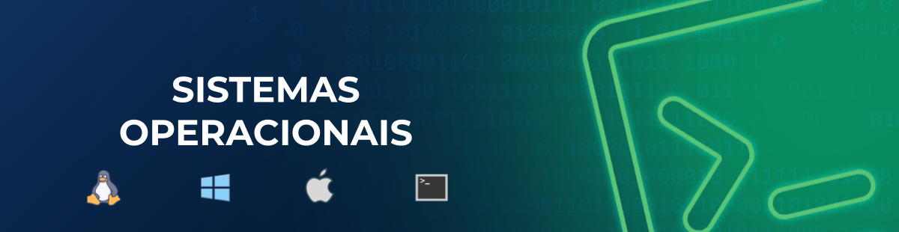

# Sistemas Operacionais

Explore os principais sistemas operacionais e suas funcionalidades neste diretório.

## Sumário

- [Windows](link_para_windows/README.md)
- [Linux](link_para_linux/README.md)
- [macOS](link_para_macos/README.md)

[<< WildStacks](../README.md) | [^ Sumário](#sumário)

